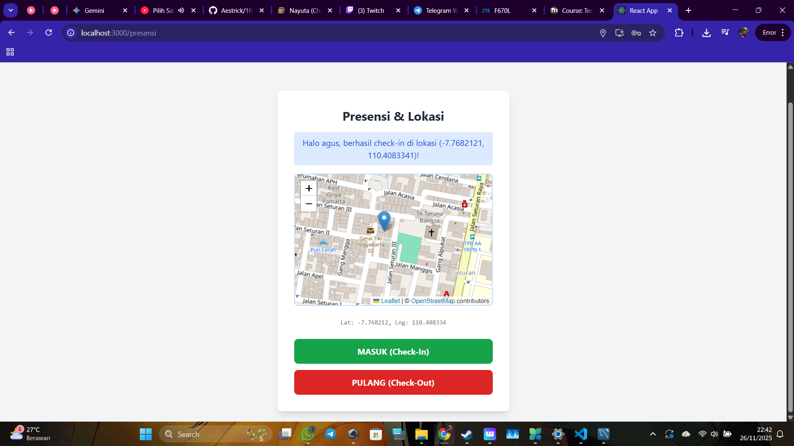
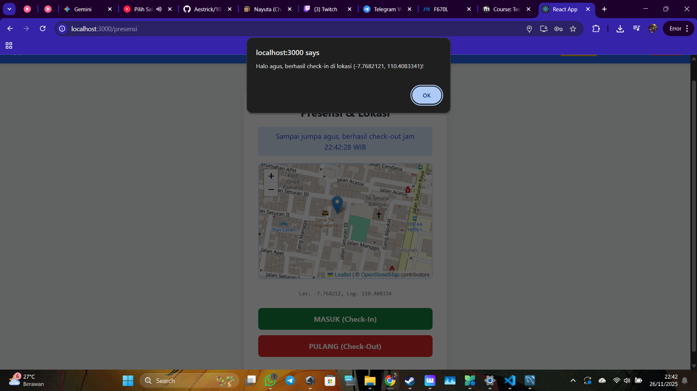
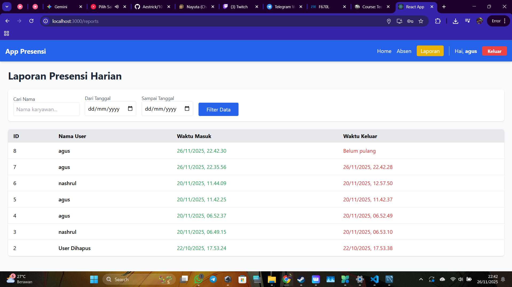
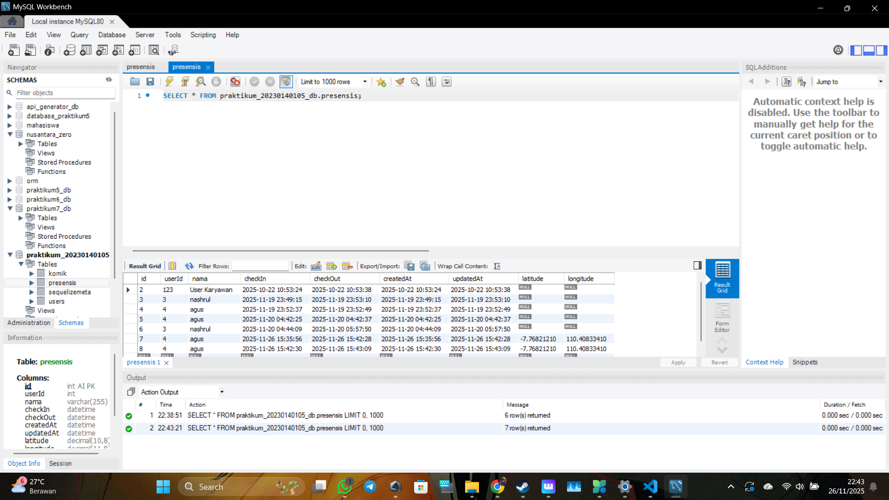

# Laporan Tugas Praktikum 9: Integrasi Geolocation & Maps

Berikut adalah hasil implementasi fitur lokasi pada aplikasi presensi.

### 1. Tampilan Halaman Presensi dengan Peta
User harus mengizinkan akses lokasi agar peta muncul.

### 2. Notifikasi Check-in Berhasil
Setelah tombol ditekan, sistem mengonfirmasi bahwa lokasi berhasil dikirim.

### 3. Tampilan Halaman Laporan (Admin)
Admin bisa melihat data presensi yang masuk.

### 4. Bukti Data Masuk ke Database
Data latitude dan longitude berhasil tersimpan di tabel MySQL.
